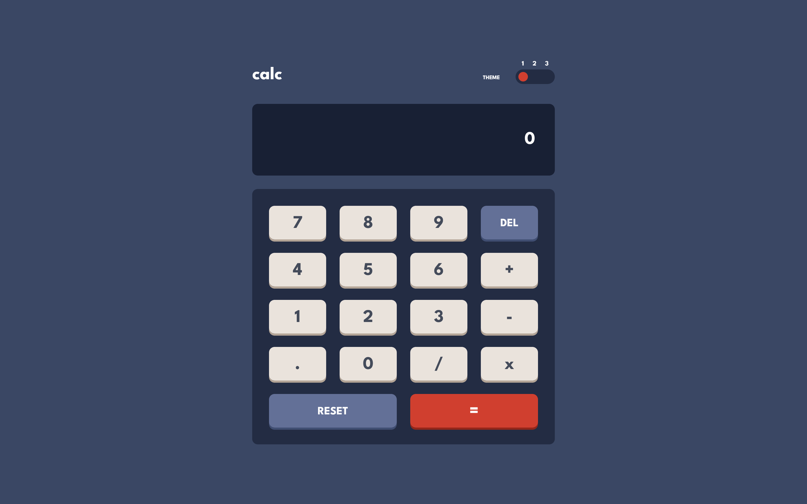
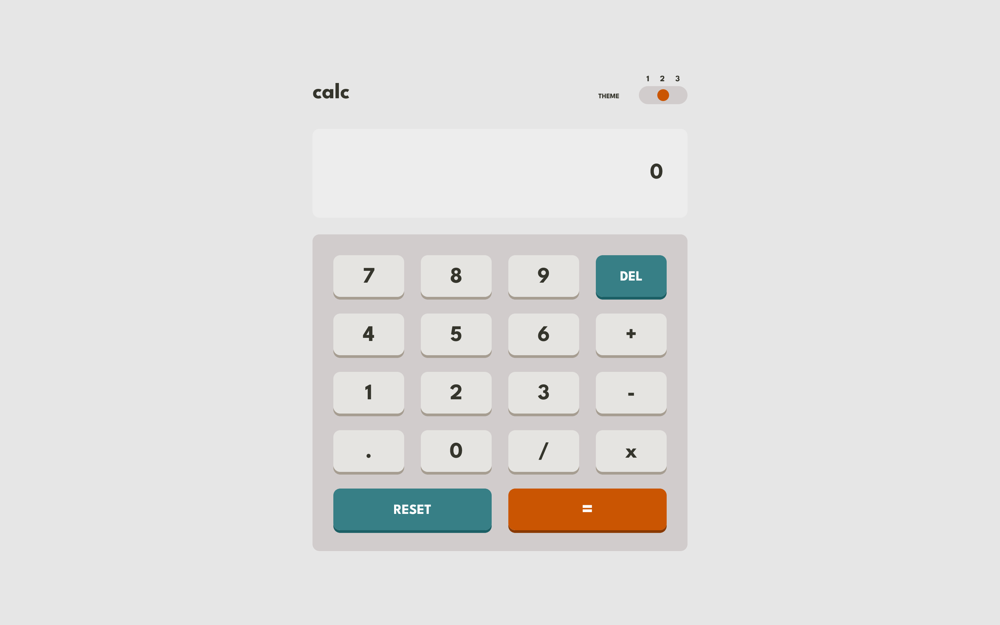
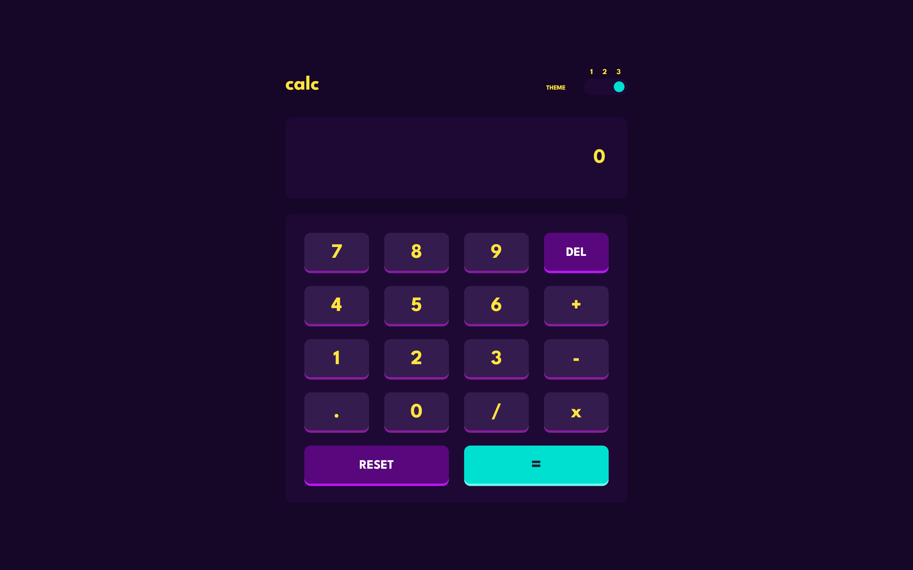
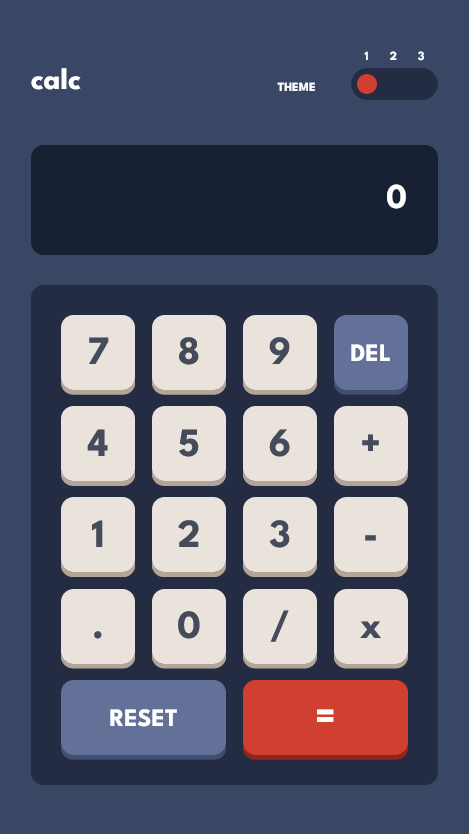
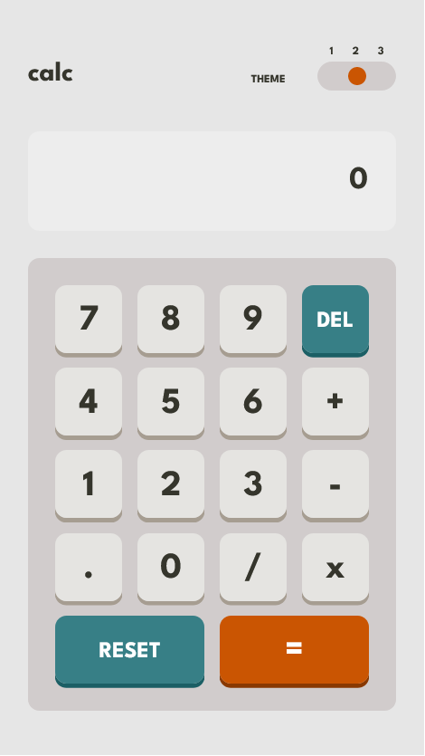
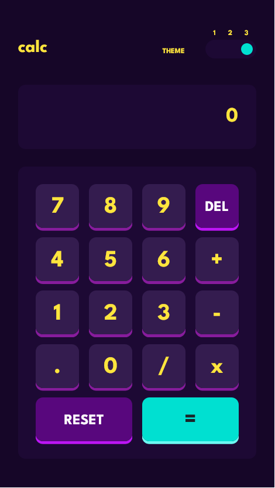

# Frontend Mentor - Calculator app solution

This is a solution to the [Calculator app challenge on Frontend Mentor](https://www.frontendmentor.io/challenges/calculator-app-9lteq5N29). Frontend Mentor challenges help you improve your coding skills by building realistic projects. 

## Table of contents

- [Overview](#overview)
  - [The challenge](#the-challenge)
  - [Screenshot](#screenshot)
- [My process](#my-process)
  - [Built with](#built-with)
  - [What I learned](#what-i-learned)
- [Author](#author)

## Overview

### The challenge

Users should be able to:

- See the size of the elements adjust based on their device's screen size
- Perform mathmatical operations like addition, subtraction, multiplication, and division
- Adjust the color theme based on their preference
- **Bonus**: Have their initial theme preference checked using `prefers-color-scheme` and have any additional changes saved in the browser

### Screenshot

## My process

### Built with

- Semantic HTML5 markup
- CSS custom properties
- Flexbox
- CSS Grid
- Mobile-first workflow
- [React](https://reactjs.org/) - JS library
- [Sass](https://sass-lang.com/) - CSS extension language
- [Vite](https://vitejs.dev/) - Development environment

### What I learned

- Set the default theme according to user preference, retrieved from the `prefers-color-scheme` in users' browsers.
- Utilize Sass mixins and color variables to switch the theme color.
- Grasp the logic of making calculations with JavaScript and React.
- Multiply each number by 100 and divide the result by 100 to avoid extra decimal digits resulting from binary calculations.

## Author

- Website - [Ruo-Fang Wang](https://wang0857.github.io/myWebPortfolios/)
- Frontend Mentor - [Ruo-Fang Wang](https://www.frontendmentor.io/profile/wang0857)
- LinkedIn - [Ruo-Fang Wang](https://ca.linkedin.com/in/ruo-fang-wang-550269226)
